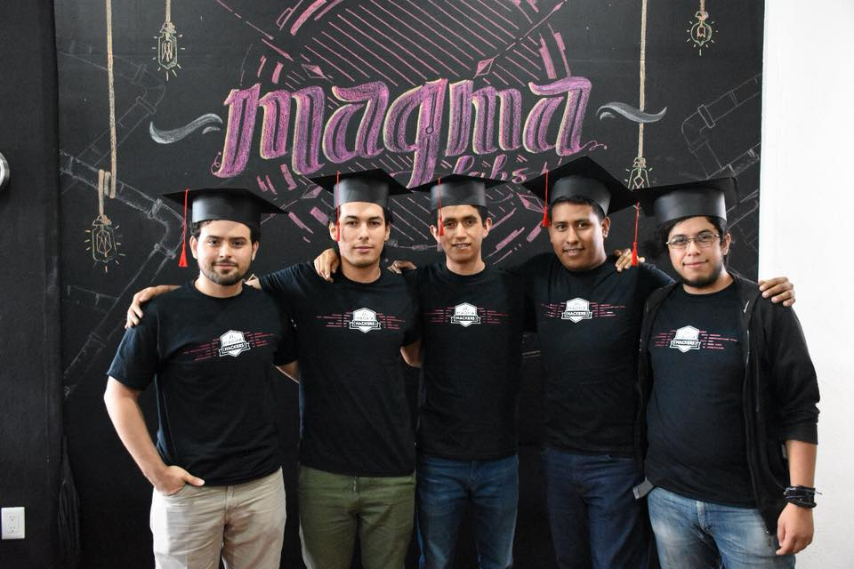
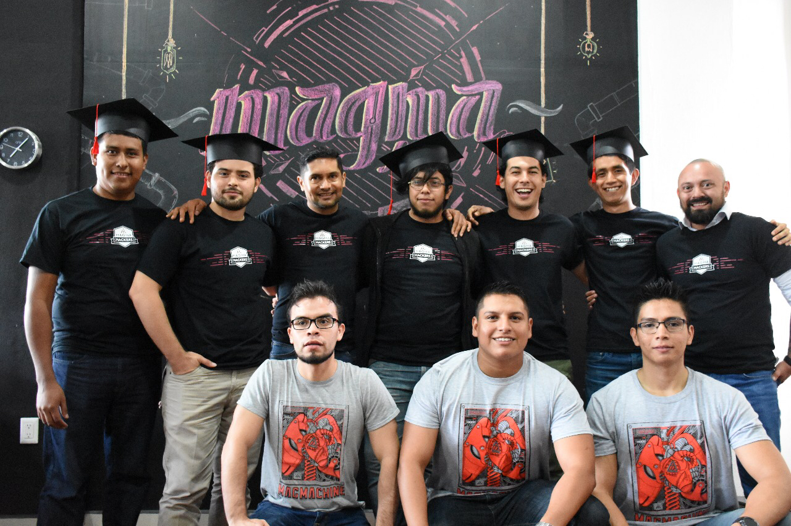

# MagmaHackers FEBRUARY 2018

## Relevant Dates

 Date| Event 
----- | ---- 
8th Feb - 8th Jun | Program
9th - 12th Jun | Hackathon
21st Jun | Graduation ceremony

## Hackers

 Num | Name | Institution
----- | ---- | ----
01 | Ismael Villavicencio Jacobo | Tecnológico de Colima
02 | Héctor Miguel Rodríguez Muñíz | Universidad de Colima
03 | Jaime Loyola Rangel | Universidad de Guanajuato
04 | Luis Armando Durán Vega | Universidad de Colima
05 | Saúl Rubio Guerrero | Tecnológico de Colima

## Mentors
 Num | Name | -  | Area 
----- | ---- | ---- | ---- 
01 | Juan Carlos Ruíz | Juan Carlos | Engineering
02 | Alberto Mendoza | Albert | Engineering
03 | José Trinidad Espinoza | Trino | Engineering
04 | José Rogelio Alatorre González | Roger | Engineering
05 | Alan Maciel | Alan | Project Management

## Program

Module | Duration | Topic
----- | ---- | ----
00 | 1 Day | [Welcome to Magmalabs!](https://github.com/magma-labs/MagmaHackers/tree/master/module-00)
01 | 3 Weeks | [Frontend programming](https://github.com/magma-labs/MagmaHackers/blob/master/module-01)
02 | 4 Weeks | [Building a Storefront using Shopify](https://github.com/magma-labs/MagmaHackers/tree/master/module-02)
03 | 4 Weeks | [Ruby programming](https://github.com/magma-labs/MagmaHackers/tree/master/module-03)
04 | 3 Weeks | [Ruby on Rails programming](https://github.com/magma-labs/MagmaHackers/tree/master/module-03)

## Results

 Num | Name | Institution
----- | ---- | ----
01 | Ismael Villavicencio Jacobo | Continued studying a master program
02 | Héctor Miguel Rodríguez Muñíz | tbd
03 | Jaime Loyola Rangel | MagmaLabs
04 | Luis Armando Durán Vega | MagmaLabs
05 | Saúl Rubio Guerrero | Received an invitation for participating in a project (CEO)

## Resources

[Here](https://github.com/magma-labs/MagmaHackers/blob/master/resources.md) you will find a list of relevant resources that will help you during this program.

## Calendar
     
Num | Module | W0 | W1 | W2 | W3 | W4 | W5 | W6 | W7 | W8 | W9 | W10 | W11 | W12 | W13 | W14 | W15 | W16
----- | ---- | ---- | ---- | ---- | ---- | ---- | ---- | ---- | ---- | ---- | ---- | ---- | ---- | ---- | ---- | ---- | ---- | ----
00 | Welcome to MagmaLabs  | [:white_circle:](https://github.com/magma-labs/MagmaHackers/tree/master/module-00)| |  | | |  |  | | |  |  | | |  |  | | 
01 | Frontend programming | | [:white_circle:](https://github.com/magma-labs/MagmaHackers/tree/master/module-01/week-01) | [:white_circle:](https://github.com/magma-labs/MagmaHackers/blob/master/module-01/week-02) | [:white_circle:](https://github.com/magma-labs/MagmaHackers/tree/master/module-01/week-03) | |  |  | | |  |  | | |  | | | |
02 | Building a storefront using shopify | | | |  | [:white_circle:](https://github.com/magma-labs/MagmaHackers/tree/master/module-02/week-01) | [:white_circle:](https://github.com/magma-labs/MagmaHackers/tree/master/module-02/week-02) | [:white_circle:](https://github.com/magma-labs/MagmaHackers/tree/master/module-02/week-03)  | [:white_circle:](https://github.com/magma-labs/MagmaHackers/tree/master/module-02/week-04) | |  |  | | |  |  | | 
03 | Ruby Programming |  |  | | |  |  | | | [:white_circle:](https://github.com/magma-labs/MagmaHackers/tree/master/module-03) | [:white_circle:](https://github.com/magma-labs/MagmaHackers/tree/master/module-03)  | [:white_circle:](https://github.com/magma-labs/MagmaHackers/tree/master/module-03) | [:white_circle:](https://github.com/magma-labs/MagmaHackers/tree/master/module-03) |  |  | | |
04 | Ruby on Rails Programming |  |  | | |  |  | | |  ||  | | [:white_circle:]() | [:white_circle:]() |[:white_circle:]() | [:white_circle:]()|[:large_blue_circle:]()
05 | Deliverables |  |  | | |  |  | | |  ||  | | [Ruby](https://github.com/magma-labs/MagmaHackers/blob/master/topics/ruby-intro.md) |  | [RoR](https://github.com/magma-labs/MagmaHackers/blob/master/topics/ruby-on-rails.md) 

## Skills

Num | Module | 01 | 02 | 03 | 04 | 05 | 06 | 07 | 08 | 09 | 10 | 11 | 12 | 13 | 14 | 15 | 16
----- | ---- | ---- | ---- | ---- | ---- | ---- | ---- | ---- | ---- | ---- | ---- | ---- | ---- | ---- | ---- | ---- | ----
01 | Html | :white_circle:| :white_circle: |:white_circle: | |  |  | | |  |  | | |  |  | | 
02 | Css | :white_circle: | :white_circle: | :white_circle:| |  |  | | |  |  | | |  | | | |
03 | Git | :white_circle:| :white_circle:| :white_circle: | :white_circle: | :white_circle: | :white_circle:  | | |  |  | | |  |  | | 
04 | Liquid |  | | |  :white_circle: | :white_circle:  |  :white_circle: | |  |  | | |  |  | | 
05 | Shopify |  |  | | :white_circle: | :white_circle: | :white_circle: | | |  |  | | |  |  | | 
06 | Sass |  |  || | :white_circle: | :white_circle: | :white_circle: | |  |  | | |  | | | |
07 | Bash | | |  | | :black_circle: | :black_circle:  | | |  |  | | |  |  | | 
08 | Ruby|  | | |  |  | | |  |  | | |  |  | | 
09 | Ruby on rails |  | | |  |  | | |  |  | | |  |  | | 
10 | Javascript |  | | |  | :white_circle: | :white_circle: | |  |  | | |  |  | | 
11 | Agile programming best practices |  | | |  | :white_circle: | | |  |  | | |  |  | | 
13 | Haml |  | | |  |  | | |  |  | | |  |  | | 
14 | Requirement Analysis |  | | |  |  | | |  |  | | |  |  | | 
15 | Tools |  | | |  |  | | |  |  | | |  |  | | 
16 | Contribute back to the community |  | | |  | :white_circle: |  :white_circle:|  :white_circle:|  |  | | |  |  | | 
17 | Comunication |  | | |  |  | | |  |  | | |  |  | | 
18 | Teamwork |  | | |  |  | | |  |  | | |  |  | | 
19 | Attitude |  | | |  |  | | |  |  | | |  |  | | 
20 | Critical thinking |  | | |  |  | | |  |  | | |  |  | | 
21 | Ego Management |  | | |  |  | | |  |  | | |  |  | | 
22 | Adaptability |  | | |  |  | | |  |  | | |  |  | | 

