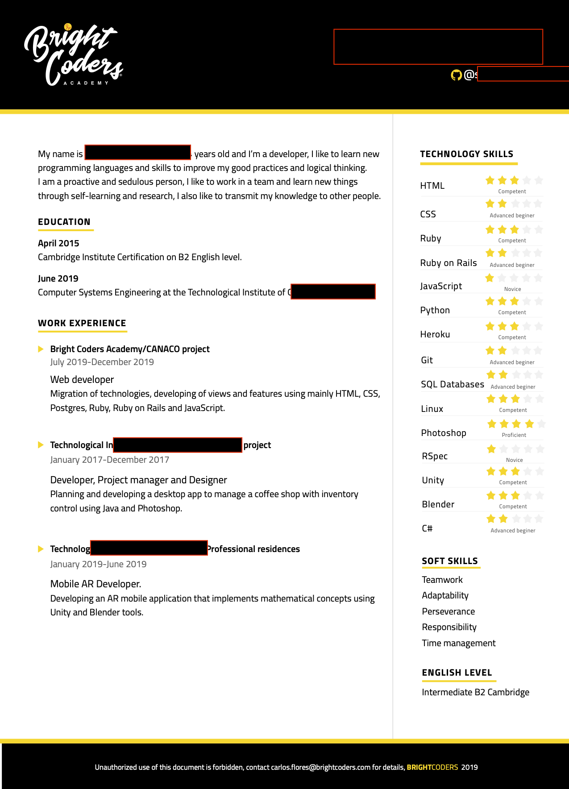
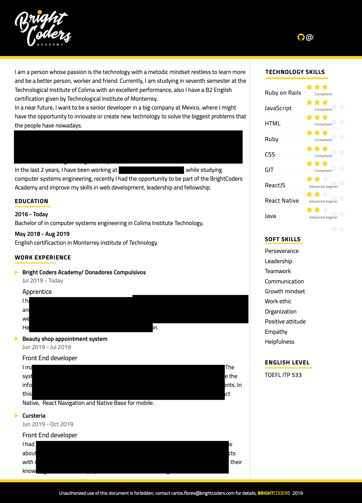

# Curriculum Vitae

Antes de graduarte de nuestro programa, queremos que tengas tu propio Curriculum Vitae (CV) ó Scorecard.

## Instrucciones

1. Para construirlo utilizaremos el formato [JSON resume](https://jsonresume.org/)
2. Descarga este archivo y remplaza la información de ejmplo con tus datos.
3. No es necesario que incluyas información en todas las secciones, utiliza solo las que apliquen.
4. De preferencia escribe tu CV en inglés.
5. Compártelo que alguien que tenga buen nivel de inglés para que lo revise y te ayude a mejorarlo.
6. Si no tienes el nivel suficiente de inglés puedes hacerlo en español

## Ejemplos

Estos son algunos ejempos de scorecards que otros Brightcoders escribieron.
NO hagas una copia de ellos simplemente utilizalos para darte una idea del tipo de información que puedes incluir. Siempre hay espacio para mejorar.

## Modelo Dreyfus

Para indicar el tu nivel de experiencia en cada habilidad (skill) utilizaremos el modelo de Dreyfus el cual considera los siguientes niveles:
- Novice
- Advanced Beginer
- Competent
- Proficient
- Expert

Utiliza los siguientes enlaces para entender de que trata cada nivel para poder ubicarte en el que te corresponde.
- [How To Evaluate Expertise: the Dreyfus Model](https://www.solcept.ch/en/blog/dreyfus-model/)
- [Building Software Development Expertise – Using The Dreyfus Model](https://skorks.com/2009/08/building-software-development-expertise-using-the-dreyfus-model/)
-[Software Engineer Qualification Levels: Junior, Middle, and Senior](https://hackernoon.com/software-engineer-qualification-levels-junior-middle-and-senior-f2229591df1c)
